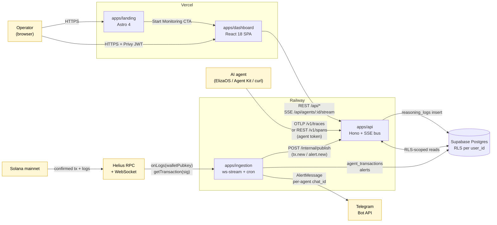
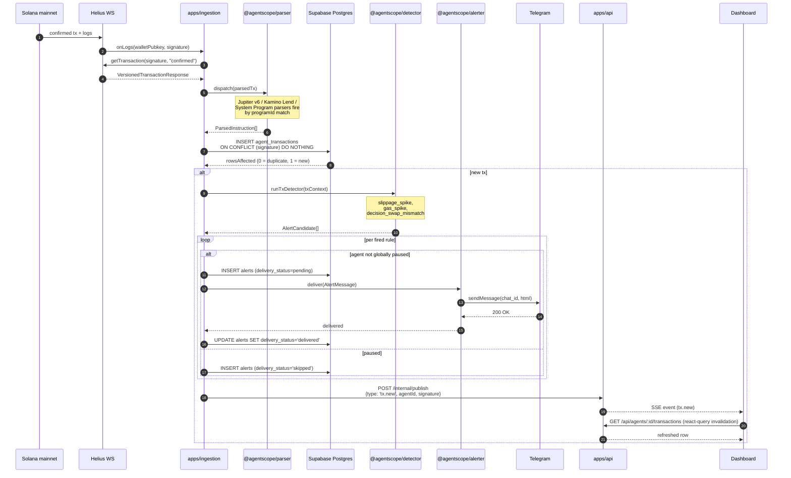
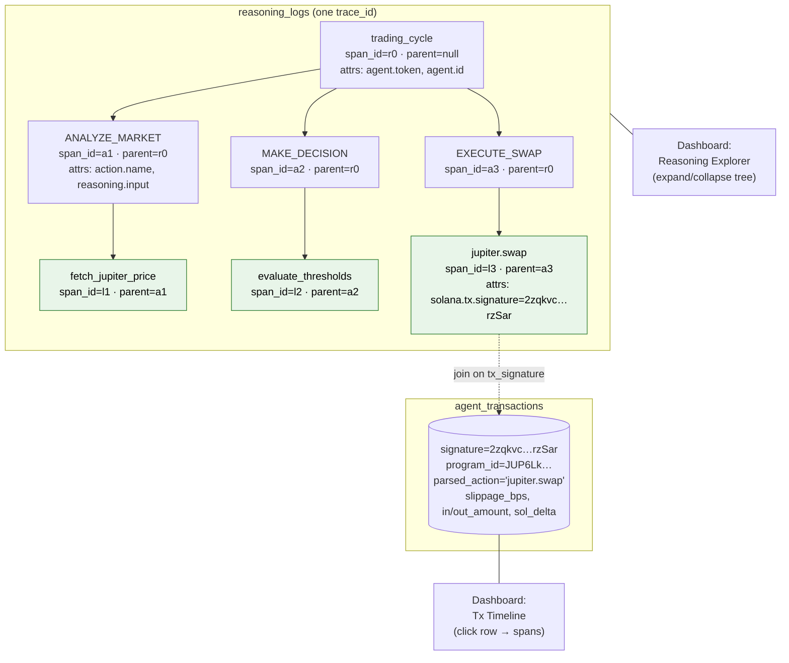

# AgentScope — Architecture

> Companion document to [README.md](./README.md). This file zooms in on **how the pieces fit together** — what data crosses which boundary, where state lives, and which file is the source of truth for each step.

AgentScope is a four-service TypeScript monorepo: an ingestion worker that subscribes to Solana, an API that fronts the database, a React dashboard, and an Astro landing page. The three runtime services share one Supabase Postgres database; cross-service events (`tx.new`, `alert.new`) are published from ingestion to the API over plain HTTP and re-broadcast to dashboard clients via SSE.

Three integration tiers let an AI agent ship its reasoning to AgentScope:

- **L0 — Universal REST** ([`POST /v1/spans`](./apps/api/src/routes/ingest.ts)): flat JSON, bearer token. Any language.
- **L1 — Standard OTLP** ([`POST /v1/traces`](./apps/api/src/routes/otlp.ts)): OTLP/HTTP, agent token rides on the `Resource` attribute `agent.token`. Any OTel-compatible tracer.
- **L2 — Drop-in SDK** ([`@agentscopehq/elizaos-plugin`](./packages/elizaos-plugin), [`@agentscopehq/agent-kit-sdk`](./packages/agent-kit-sdk)): Node-only convenience.

The three diagrams below cover, in order: the **system context** (every external system and every service in one frame), the **transaction-flow sequence** (a confirmed Solana tx walks the pipeline from chain to UI), and the **reasoning tree** (how OTel spans nest and how `tx_signature` correlates a span back to a parsed on-chain action).

---

## 1. System context

How the three external systems (Solana, the AI agent, the Telegram Bot API) connect to the four AgentScope services and the one shared database.

### Notes on this diagram

- **Helius is the only chain entry.** Both the WebSocket subscription ([`apps/ingestion/src/ws-stream.ts`](./apps/ingestion/src/ws-stream.ts)) and the subsequent `getTransaction` hydration call go to a Helius RPC URL. Free-tier WebSocket is sufficient for MVP traffic; gRPC (LaserStream) is post-MVP per [docs/PLAN.md](./docs/PLAN.md).
- **Ingestion writes the DB directly, not through the API.** The API has no ingestion endpoints for on-chain data — agents do not POST their own transactions. The only writes the API performs are `reasoning_logs` inserts (from `/v1/traces` and `/v1/spans`) and `agents` CRUD.
- **One shared SSE bus.** The `apps/ingestion` worker emits `tx.new` / `alert.new` events via `POST /internal/publish` (shared `INTERNAL_SECRET`); the API multiplexes them out to per-agent SSE channels for the dashboard. See [`apps/api/src/lib/sse-bus.ts`](./apps/api/src/lib/sse-bus.ts) and [`apps/api/src/routes/stream.ts`](./apps/api/src/routes/stream.ts).
- **No deployer-wide Telegram fallback.** Each agent carries its own `telegram_chat_id` ([epic 14 multi-tenant safety](./docs/SPEC.md)). The bot token is the only deployer-side secret; the chat ID is per-tenant data.
- **Cross-tenant isolation is enforced in the DB, not the API.** Every API query runs with `current_user_id()` set as a session variable; Postgres RLS policies on `agents`, `agent_transactions`, `reasoning_logs`, and `alerts` filter rows by ownership. The API cannot accidentally leak a row because the `WHERE` clause is at the DB level. Ingestion uses `BYPASSRLS` (service role) so the worker can write to any tenant's tables.

---

## 2. Transaction flow

What happens between a Solana validator confirming an agent's swap and the dashboard re-rendering. This is the **hot path** — everything from `runTxDetector` onward is invoked once per confirmed transaction; the path is single-process inside `apps/ingestion` for the parse/persist/detect/alert steps, then a fire-and-forget HTTP hop to the API for SSE fan-out.

### Notes on this diagram

- **Idempotency is at the DB.** The unique constraint on `agent_transactions.signature` is the single source of truth — the worker can replay the same signature, and only the first INSERT will return `rowsAffected = 1` and proceed to the detector. Restarts and at-least-once delivery from Helius are safe by construction.
- **Tx-triggered rules vs. cron-triggered rules.** The diagram shows the **tx-triggered** rules (`slippage_spike`, `gas_spike`, `decision_swap_mismatch`). Cron rules (`error_rate`, `drawdown`, `stale_agent`, `ghost_execution`, `stale_oracle`) run every 60s from inside the same ingestion process — see [`apps/ingestion/src/cron.ts`](./apps/ingestion/src/cron.ts). They share the same alerter and SSE-publish path but are not in this diagram to keep it readable.
- **The SSE hop is asynchronous and best-effort.** `POST /internal/publish` is fire-and-forget — if the API is down, the dashboard misses the live update but the DB row is already persisted and a hard refresh recovers it. The dedicated `INTERNAL_SECRET` header gates this endpoint so a public attacker cannot inject events.
- **Per-agent global pause** (`agents.alerts_paused_until`) short-circuits delivery, **not** detection. The alert is still inserted with `delivery_status='skipped'` so the audit trail records what would have fired — this is the polish item from P.9.

### Source-of-truth files for each step

| Step | File |
|---|---|
| WebSocket subscription | [apps/ingestion/src/ws-stream.ts](./apps/ingestion/src/ws-stream.ts) |
| Hydration + dispatch | [apps/ingestion/src/persist.ts](./apps/ingestion/src/persist.ts) |
| Parser router | [packages/parser/src/dispatcher.ts](./packages/parser/src/dispatcher.ts) |
| Jupiter v6 parser | [packages/parser/src/jupiter/parser.ts](./packages/parser/src/jupiter/parser.ts) |
| Kamino Lend parser | [packages/parser/src/kamino/parser.ts](./packages/parser/src/kamino/parser.ts) |
| System Program labeller | [packages/parser/src/system/parser.ts](./packages/parser/src/system/parser.ts) |
| Detector engine | [packages/detector/src/evaluate.ts](./packages/detector/src/evaluate.ts) |
| Rules | [packages/detector/src/rules/](./packages/detector/src/rules/) |
| Telegram delivery | [packages/alerter/src/telegram.ts](./packages/alerter/src/telegram.ts) |
| SSE publish (ingestion side) | [apps/ingestion/src/event-publisher.ts](./apps/ingestion/src/event-publisher.ts) |
| SSE bus (API side) | [apps/api/src/lib/sse-bus.ts](./apps/api/src/lib/sse-bus.ts) |
| SSE fan-out route | [apps/api/src/routes/stream.ts](./apps/api/src/routes/stream.ts) |

---

## 3. Reasoning tree

How an agent's OTel spans nest, and how a span on the swap-execution leaf is correlated to the row in `agent_transactions` produced from the same signature in diagram 2.

The example below is a real shape from the live ElizaOS demo agent (commit `8ef79a1`-era): one `trading_cycle` parent span emitted by the ElizaOS plugin's `wrapActions`, three ElizaOS-action children, and one leaf span at the bottom of `EXECUTE_SWAP` that records the Solana signature as `solana.tx.signature`.

### Notes on this diagram

- **One `trace_id` per agent decision cycle.** Every span the agent emits inside a `wrapActions(actions, runtime)` invocation shares the same trace, regardless of how deep `traced(name, fn)` is nested. Parent/child relationships are written by the OTel SDK via Context API and persisted to `reasoning_logs.parent_span_id`.
- **Correlation is by `solana.tx.signature` attribute.** When the agent's swap step has the signature available (post-`sendTransaction`), the SDK attaches it as a span attribute, which the API flattens into `reasoning_logs.tx_signature` on insert. The dashboard's Reasoning Explorer joins `reasoning_logs.tx_signature = agent_transactions.signature` to render a tx ↔ trace cross-link.
- **The agent owns the schema of intermediate spans.** AgentScope does not prescribe an action taxonomy — `ANALYZE_MARKET` / `MAKE_DECISION` / `EXECUTE_SWAP` in the example are ElizaOS-side action names, not AgentScope vocabulary. The plugin wraps whatever actions the runtime supplies. Likewise, `@agentscopehq/agent-kit-sdk` exposes a `traced(name, fn, attrs)` primitive — the name is free-form.
- **`agent.token` is on the `Resource`, not the span.** The agent identity attribute lives on the OTel `Resource`, so every span in the export inherits it without per-span boilerplate. The `/v1/traces` receiver reads it from the resource attributes and looks up `agents.ingest_token` in the database. See [`apps/api/src/routes/otlp.ts`](./apps/api/src/routes/otlp.ts).

### Source-of-truth files

| Concern | File |
|---|---|
| OTLP receiver (L1) | [apps/api/src/routes/otlp.ts](./apps/api/src/routes/otlp.ts) |
| Flat REST receiver (L0) | [apps/api/src/routes/ingest.ts](./apps/api/src/routes/ingest.ts) |
| ElizaOS auto-instrumentation | [packages/elizaos-plugin/src/](./packages/elizaos-plugin/src/) |
| Agent Kit SDK | [packages/agent-kit-sdk/src/](./packages/agent-kit-sdk/src/) |
| DB schema (`reasoning_logs.tx_signature`) | [packages/db/src/schema.ts](./packages/db/src/schema.ts) |
| Reasoning API read | [apps/api/src/routes/reasoning.ts](./apps/api/src/routes/reasoning.ts) |

---

## Cross-cutting concerns

### Authentication & multi-tenancy

| Caller | Mechanism | Where validated |
|---|---|---|
| Dashboard → `/api/*` | Privy JWT in `Authorization: Bearer` | [apps/api/src/middleware/auth.ts](./apps/api/src/middleware/auth.ts) |
| Agent → `/v1/traces` | `agent.token` OTel Resource attribute → `agents.ingest_token` lookup | [apps/api/src/routes/otlp.ts](./apps/api/src/routes/otlp.ts) |
| Agent → `/v1/spans` | `Authorization: Bearer <ingest_token>` | [apps/api/src/routes/ingest.ts](./apps/api/src/routes/ingest.ts) |
| Ingestion → `/internal/publish` | shared `INTERNAL_SECRET` header (timing-safe compare) | [apps/api/src/app.ts](./apps/api/src/app.ts) |

### Rate limiting

In-process token-bucket per identity ([`apps/api/src/middleware/rate-limit.ts`](./apps/api/src/middleware/rate-limit.ts)). Three buckets, all single-instance for MVP scale:

- **Agent create**: 10 / hour / `userId`
- **Agent create per IP**: 3 / 24h (P.5 abuse mitigation)
- **OTLP ingest**: 100 / minute / agent token

Swap for Redis `INCR + EXPIRE` if Railway scales out.

### Database & RLS

Postgres (Supabase free tier). Five tables — all with RLS enabled:

| Table | RLS predicate | Notes |
|---|---|---|
| `users` | `id = current_user_id()` | Privy DID → internal UUID mapping |
| `agents` | `owner_id = current_user_id()` | Carries `ingest_token`, `telegram_chat_id`, `alert_rules` JSONB, `alerts_paused_until` |
| `agent_transactions` | `agent_id IN (SELECT id FROM agents WHERE owner_id = current_user_id())` | RANGE-partitioned by `block_time`, monthly. RLS is enabled on **each child partition** (migration `0010`) — Postgres does not inherit RLS from the parent. |
| `reasoning_logs` | same agent-ownership join | Flattened OTel span attributes, optional `tx_signature` |
| `alerts` | same agent-ownership join | `delivery_status` ∈ {`pending`, `delivered`, `failed`, `skipped`} |

Ingestion runs under a `BYPASSRLS` service role so the worker can write to any tenant's tables. The API runs under the `authenticated` role and sets `current_user_id()` as a session variable on every request.

### Deployment topology

| Layer | Where | Process model |
|---|---|---|
| `apps/api` | Railway (Nixpacks) | One Node 24 process, `tsx` runtime |
| `apps/ingestion` | Railway (Nixpacks) | One Node 24 process, hosts both WebSocket subscriber and 60s cron evaluator |
| `apps/dashboard` | Vercel | Static SPA, Vite build |
| `apps/landing` | Vercel | Astro static build |
| Postgres | Supabase free | Transaction pooler on port 6543 |

API and ingestion talk over the public Railway URL for SSE publishes; both read/write the same Supabase via the pooled `DATABASE_URL`. Full env-var matrix lives in [docs/DEPLOY.md](./docs/DEPLOY.md).

---

## Where to go next

- **Quickstart (operator)**: [docs/QUICKSTART.md](./docs/QUICKSTART.md) — register an agent, copy the snippet, see traces in &lt;3s.
- **Spec (product)**: [docs/SPEC.md](./docs/SPEC.md) — feature list, non-goals, scope boundaries.
- **Plan (technical)**: [docs/PLAN.md](./docs/PLAN.md) — stack rationale, schema deltas, security posture.
- **Deploy runbook**: [docs/DEPLOY.md](./docs/DEPLOY.md) — Railway, Vercel, Supabase setup.
- **Demo script**: [docs/DEMO-SCRIPT.md](./docs/DEMO-SCRIPT.md) — 5-scene walkthrough mirroring the submission video.
